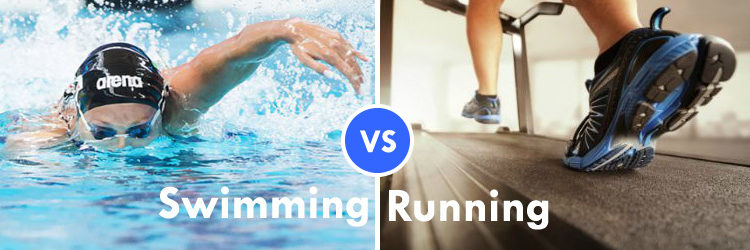

# Why We Think Running is the Best Workout

### 1. Running is convenient. 
### 2. Running is a great runner up.
### 3. Running helps to build stronger bones.
### 4. Running can strengthen muscles. 
### 5. improve cardiovascular fitness.
 
## Conclusion

 Running is the best exerice in the world!

 If you do not have your own swimming pool, it can be hard to get swimming time. You have to adhere to your club, gym or public pool’s schedule. With running, you can run anywhere. If it is raining outside, you can run on a treadmill to lose weight.People can burn almost 700 calories if they run seven miles an hour. There is more potential to lose weight with running.Running can increase your chances of getting a bone fracture. Your arms do move while you run, but it is not going up against resistance like it does in swimming.
 
==================================================

#Why We Think Swimming is the Best Workout

###1. Swimming builds endurance and improves the lungs.
###2. You get a workout without the sweat.
###3. Swimming is another form of strength training.
###4. Swimming builds bone mass.
###5. Swimming burns tons of calories.

##Conclusion
“The water doesn’t know your age.” – Dara Torres (Olympic swimmer)

Clearly, swimming is one of the best workouts you can get. Swimming makes working out accessible for people who can’t or isn’t interested in running, biking, or other forms of cardio. To be clear, though, you will feel the burn. If you swim for exercise and not just fun, you’ll get your heart rate going and get the same benefits as cardio and resistance training. You just won’t get all sweaty while you’re doing it! And you’ll probably be able to swim for a longer period of time than you could run.

For a great body all year round, swim regularly. Find a gym with a pool so that you can incorporate swimming into your workout routines regularly.
For a great body all year round, swim regularly. Find a gym with a pool so that you can incorporate swimming into your workout routines regularly.

###Prerequisites
Two editior and git!

##Author
1. Qiaoxue Luan
2. Zhu Meng

##license
This project is licensed under the LAB licenses.

